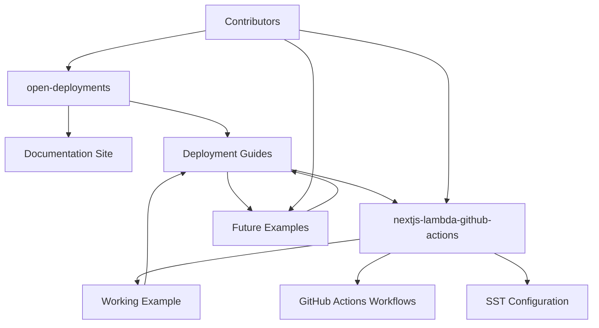

import { Steps, Callout } from "nextra/components";

export const metadata = {
  title: "Project Architecture",
  description:
    "Understanding how Open Deployments projects are structured and interconnected.",
  openGraph: {
    title: "Project Architecture - Open Deployments",
    description:
      "Learn about the architecture and relationships between Open Deployments projects.",
  },
};

# Project Architecture

This document explains how the different Open Deployments projects are structured and how they work together to provide a comprehensive deployment documentation platform.

## Project Overview

The Open Deployments ecosystem consists of multiple interconnected repositories, each serving a specific purpose in the deployment documentation and example workflow.

## Repository Structure

### 1. Main Documentation Site (`open-deployments`)

**Purpose:** Central documentation hub and website  
**Location:** `/open-deployments/`  
**Technology:** Next.js with Nextra (documentation framework)

```
open-deployments/
├── app/
│   ├── frameworks/           # Framework-specific guides
│   │   └── nextjs/
│   │       └── aws-lambda/
│   │           └── github/   # GitHub Actions deployment guide
│   ├── providers/           # Infrastructure provider guides
│   ├── contributors/        # Maintenance documentation
│   └── get-started/        # Setup guides
├── components/             # Reusable UI components
└── sst.config.ts          # SST deployment configuration
```

**Key Features:**
- Framework deployment guides
- Infrastructure provider documentation
- Step-by-step tutorials
- Example repository links
- Contributor documentation

### 2. Example Repositories

**Purpose:** Working examples that demonstrate deployment patterns  
**Naming Pattern:** `{framework}-{infrastructure}-{ci-platform}`

#### Example: `nextjs-lambda-github-actions`

**Location:** `/nextjs-lambda-github-actions/`  
**Technology:** Next.js + AWS Lambda + GitHub Actions

```
nextjs-lambda-github-actions/
├── .github/
│   └── workflows/
│       ├── production.yml        # Deploy workflow
│       └── remove-production.yml # Cleanup workflow
├── app/                         # Next.js application
├── sst.config.ts               # Infrastructure definition
└── package.json               # Dependencies
```

## Project Relationships

### Documentation ↔ Examples

<Steps>

## Documentation References Examples

The main documentation site (`open-deployments`) contains guides that reference example repositories:

- **Step-by-step tutorials** link to working code examples
- **Configuration snippets** are extracted from example repositories
- **Workflow files** are documented with real implementations

## Examples Validate Documentation

Example repositories serve as validation for the documentation:

- **Working deployments** prove the guides are accurate
- **CI/CD pipelines** test the deployment procedures
- **Real infrastructure** demonstrates the end result

## Bidirectional Updates

Changes in either project require updates in both:

- **New features** in examples → documentation updates
- **Guide improvements** → example repository updates
- **Best practices** → propagated across all examples

</Steps>

### Repository Interconnections



## Technology Stack Integration

### Frontend Documentation (Next.js + Nextra)

**Purpose:** Static site generation with documentation features

- **Nextra framework** - Documentation-focused Next.js setup
- **MDX support** - Markdown with React components
- **Code highlighting** - Syntax highlighting for multiple languages
- **Navigation** - Automatic sidebar generation from file structure

### Infrastructure as Code (SST)

**Purpose:** Unified infrastructure management across all projects

- **Multi-provider support** - AWS, Cloudflare, etc.
- **Type-safe configuration** - TypeScript-based infrastructure
- **Stage management** - Development vs production environments
- **Resource linking** - Connect related infrastructure components

### CI/CD Integration (GitHub Actions)

**Purpose:** Automated deployment and maintenance workflows

- **Deployment automation** - Triggered on code changes
- **Infrastructure management** - Deploy and remove resources
- **Safety measures** - Confirmation steps for destructive operations
- **Environment management** - Separate staging and production

## Development Workflow

### Creating New Examples

<Steps>

## Plan the Example

1. **Identify use case** - What deployment pattern to demonstrate
2. **Choose technology stack** - Framework + Infrastructure + CI/CD
3. **Design repository structure** - Follow established patterns

## Implement the Example

1. **Create repository** - Initialize with basic application
2. **Add infrastructure config** - SST configuration file
3. **Setup CI/CD workflows** - Deployment and cleanup automation
4. **Test deployment** - Verify everything works end-to-end

## Document the Process

1. **Create guide** - Step-by-step instructions in main docs
2. **Link repositories** - Connect documentation to examples
3. **Add to navigation** - Update `_meta.ts` files
4. **Review and test** - Ensure documentation is accurate

</Steps>

### Maintenance Workflow

#### Regular Updates

1. **Dependency updates** - Keep frameworks and tools current
2. **Security patches** - Apply security updates promptly
3. **Documentation sync** - Keep guides aligned with examples
4. **Infrastructure optimization** - Improve cost and performance

#### Breaking Changes

1. **Version compatibility** - Test with new framework versions
2. **Migration guides** - Document upgrade procedures
3. **Backward compatibility** - Support multiple versions when possible
4. **Deprecation notices** - Communicate timeline for changes

## Quality Assurance

### Testing Strategy

- **End-to-end testing** - Deploy examples in test environments
- **Documentation testing** - Verify all steps work as documented
- **Link checking** - Ensure all repository links are valid
- **Security scanning** - Regular security audits of examples

### Review Process

- **Code review** - All changes reviewed by maintainers
- **Documentation review** - Technical writing review for clarity
- **Infrastructure review** - Cost and security implications
- **User testing** - Feedback from community users

## Scaling Considerations

### Adding New Frameworks

When adding support for new frameworks:

1. **Assessment** - Evaluate community demand and maintenance effort
2. **Template creation** - Develop reusable patterns
3. **Documentation structure** - Consistent organization
4. **Maintenance planning** - Long-term support strategy

### Infrastructure Providers

For new infrastructure providers:

1. **Provider evaluation** - Technical capabilities and SST support
2. **Cost analysis** - Compare pricing and resource efficiency
3. **Integration complexity** - Development and maintenance effort
4. **Community benefit** - Value to the user community

<Callout type="info">
The architecture is designed to be modular and extensible, allowing for easy addition of new frameworks, infrastructure providers, and CI/CD platforms while maintaining consistency and quality across all examples.
</Callout>