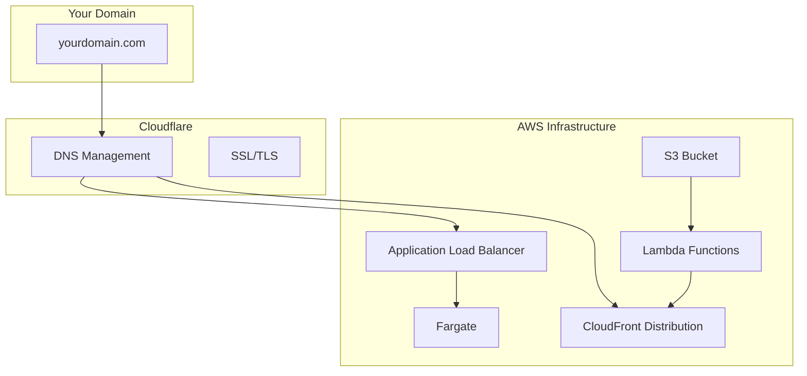

import { Callout, Steps } from "nextra/components";

# Cloudflare IAC

## Use Cloudflare with Infrastructure As Code

To manage DNS records and other Cloudflare services programmatically, you'll need to set up API credentials. With the API access you will be able to connect your domain to your AWS infrastructure. So for example if your application is on 123.cloudfront.net, with Cloudflare IAC you will be able to connect that domain to your domain.com

## How AWS connects with Cloudflare

## Prerequisites

- A Cloudflare account
- At least one domain added to Cloudflare
- Domain must be using Cloudflare nameservers

## Getting API Token

<Steps>

    ### Log in to the Cloudflare Dashboard

    Go to [Cloudflare Dashboard](https://dash.cloudflare.com/) and sign in with your account.

    ### Navigate to API Tokens

    Go to **My Profile** → **API Tokens** from the top right menu.

    ### Create a new API Token

    Click **Create Token** button to start creating a new API token.

    ### Choose the Edit Zone DNS template

    Select **Edit Zone DNS** template, which provides the necessary permissions for DNS management.

    ### Configure token permissions

    Configure the following settings:
    - **Permissions**: Zone:DNS:Edit, Zone:Zone:Read
    - **Zone Resources**: Include specific zones or all zones
    - **Client IP Address Filtering**: (Optional) Restrict to specific IPs

    ### Generate and copy the token

    Click **Continue to summary** → **Create Token**

    Copy the generated API token immediately as it won't be shown again.

    <Callout type="warning">
        **Security notes:**
        

            - Save the API token immediately when it's shown - it cannot be retrieved again after initial creation
        

        

            - Store the token securely in your password manager or environment variables
        

        

            - Never commit API tokens to version control systems
        

    </Callout>

</Steps>
